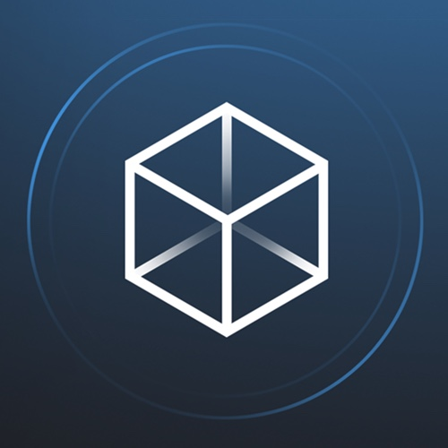

<!-- SPDX-License-Identifier: MIT -->

<h1 align="center">DnA Platform

  
</h1>

## DnA Platform (Data and Analytics Platform) and its features

The idea of the DnA Platform originated from the common challenge every big company has - the need for transparency in the data and analytics area. In addition, several features were envisioned and realized, this time with the idea to enable a self-service and cloud-independent platform based holistically on open-source software. The goal is to simplify life and speed up the work of everybody who is working with data. Let's look at the features DnA Platform offers out of the box.

| Feature Name  | Description  | Availability in Github  | 
|---|---|---|
| [DnA Portal Feature](./docs/DnAPortal.md)    | Wrapper feature that packages all features into one streamlined user experience.  | Since 24.12.2021  | 
| [Solution Transparency feature](./docs/DnATransparency.md)    | Feature that enables you getting transparency on different initiatives around Data/ML/AI and collaboration between people working on similar activities.  | Since 24.12.2021  | 
| [Report Transparency feature](https://github.com/mercedes-benz/DnA/wiki/Report-transparency)    | Feature that enables you creating transparency on reports and dashboards produced in organization.  | November 2022  | 
| [Data sharing Transparency feature](https://github.com/mercedes-benz/DnA/wiki/Data-sharing-transparency)    | Feature that enables you creating transparency on which data is being used where in the company and for which purpose.  | February 2023  |
| [Data product Transparency feature](https://github.com/mercedes-benz/DnA/wiki/Data-product-transparency)    | Feature that enables you creating transparency on which data products are existing in the company and through which access type they can be used (eg. SQL, Kafka, API, file,...).  | May 2023  |
| [Malware Scan As A Service Feature](./docs/DnAMalwareScanAsAService.md)  |  Feature that provides a simple REST API to check all kinds of attachments for malicious code, abstracting the [ClamAV](https://github.com/Cisco-Talos/clamav) scanner usage and making it ready for web world.  | February 2022   | 
|  [Data Pipeline Feature](./docs/DnADataPipeline.md)  | This feature integrates [Apache Airflow](https://github.com/apache/airflow) as major component in DnA Platform, enabling processing and transforming of data  | February 2022  | 
|  [Jupyter Notebook Workspace Feature](./docs/DnAJupyterNotebookWorkspace.md)  | Feature based on [JupyterHub](https://github.com/jupyterhub/jupyterhub) enables users to start working on their models without any additional software installation.   | February 2022   |  
| [Dataiku integration feature](./docs/DnADataikuWorkspace.md)   | This is the only feature that does not follow the open source principle completely as [Dataiku](https://doc.dataiku.com/dss/latest/concepts/index.html) is a licensed product. Still, even for Dataiku we are offering integration into the DnA Platform in case you are operating it also (if not, simply disable it in configuration).  | February 2022  |
| [MLOps Pipeline](https://github.com/mercedes-benz/DnA/blob/docs/kfserving-tutorial/docs/DnAMLOPsArchitecture.md) | A holistic Kubernetes native MLOps pipeline based on [Kubeflow](github.com/kubeflow) components and optimized for secure enterprise environments. For more info, you can read the [DnA - Kubeflow Pipelines](./docs/DnAKFPTutorial.md) & [DnA - Kserve](./docs/DnAKServeTutorial.md) tutorials. | March 2022 | 
| [Data sharing Transparency feature](https://github.com/mercedes-benz/DnA/wiki/Code-Spaces)    | Feature that provides Visual Studio Code for single developer or team (Collaboration) with code templates for different technologies in the web and enables you automatic deployments.  | March 2023  |
 

## Upcoming Features

As Data Pipelines, Jupyter notebook, Kubeflow Pipelines, and other features require some kind of managed persistence layer, we are considering the integration of  [MinIO](https://github.com/minio/minio) as an S3 storage model along with the addition of [DeltaLake](https://github.com/delta-io/delta) to enable native Spark processing and ACID compliance.

The list of future ideas is big and it is constantly being adjusted, so please include yourself in the discussion! We are looking forward to different ideas!

## Installation

if you want to try the DnA Platform ,please follow the [installation guide](./docs/Install.md). In the installation guide we are provding 2 ways to install this application(Docker-compose and Helm) . Use Docker-compose only for local testing .

For a complete production installation, we recommend the installation using helm.Currently in our helm and docker-compose we are providing multiple service like DnA , Dashboard, Naas , Malware Scan,Vault service,storage-service ,Airflow and Jupyter Notebooks.

Very soon we are going to provide you the docker-compose and helm-chart for kubeflow-pipeline, Model Registry and Trino . So stay tuned to our repo frequently .

## Architecture

If you are interested to get a glimpse on how is this all tied up all together have a look at [this short overview](./docs/DnAArchitecture.md).

## Security

If you are interested to find out what we are doing to enasure security on the platform have a look at [this short overview](./docs/DnASecurity.md).

## Contributing

We welcome any contributions. As we are a freshly created open source community, we may need a few weeks to settle and be able to accept your ideas or contributions efficiently. During January 2022, we will bring other features on the platform, and then this repository will become our primary repo and place to collaborate with you. Until then, we will still work on our private enterprise repo and syncing code manually. If you want to contribute to the project please read the [contributing guide](CONTRIBUTING.md).

## Code of Conduct

Please read our [Code of Conduct](https://github.com/Daimler/daimler-foss/blob/master/CODE_OF_CONDUCT.md) as it is our base for interaction.

## License

This project is licensed under the [MIT LICENSE](LICENSE).

## Provider Information

Please visit <https://www.daimler-tss.com/en/imprint/> for information on the provider.

Notice: Before you use the program in productive use, please take all necessary precautions,
e.g. testing and verifying the program with regard to your specific use.
The program was tested solely for our own use cases, which might differ from yours.
