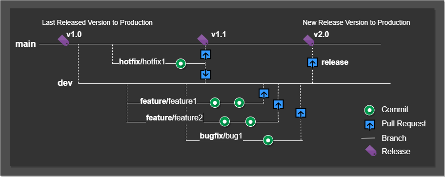

# Git Branching Strategy

`main` is the default branch and has the latest stable production-ready code. Committing is only possible by PR from the `dev` branch.

### Checkout a new branch from a  `dev `for your contribution

* Contributors are requested to checkout a new branch from the `dev` and start contributing. Let's call it the new branch called `feature/imageUpload`.
* Post-completion of work on the  `feature/imageUpload` branch. Create **Pull Request** for the `dev `branch from `the feature/imageUpload` branch.
* Our technical team will review the PR and merge it to `dev`. Post-completion of PR, `feature/imageUpload` branch will be deleted.
* Once your changes are on the `dev` branch. Our team will run different levels of the test to make sure quality, security, and compliance.
* Once all test is passed, our team will create a new release **PR** to the  `main` branch from `dev`.

  
* Note: All new branch checkout from `dev `not from `main` branch, except `hotfix `branch. Please follow the brach naming convention.

### Branch naming convention

| Acceptable Branch     | Description                                                                                                                                                                                                               |
| --------------------- | ------------------------------------------------------------------------------------------------------------------------------------------------------------------------------------------------------------------------- |
| main                  | `main` is the default branch, committing is only possible by PR from `dev `branch.                                                                                                                                    |
| dev                   | `dev` branch where our development code will be there, committing is only possible by PR from `your_branch `. Note: It has an unstable version of the code.                                                           |
| feature/<branch_name> | Example:`feature/imageUpload`  If you are working on new features that are under the development stage then, create the branch name with the prefix `feature/`. `<branch_name>` replace with the feature name. |
| bugfix/<branch_name>  | Example:`bugfix/codeFix`  If you are working bug then, create the branch name with the prefix `bugfix/`.`<branch_name>` replace with the bug name.                                                             |
| patch/<branch_name>   | Example:`patch/urlIncorrect`  If you are working production bug then, create the branch name with the prefix `patch/`.`<branch_name>` replace with the bug name.                                               |
| docs/<branch_name>    | Example:`docs/installDoc`  If you are working documentation then, create the branch name with the prefix `docs/`.`<branch_name>` replace with the bug name.                                                    |
