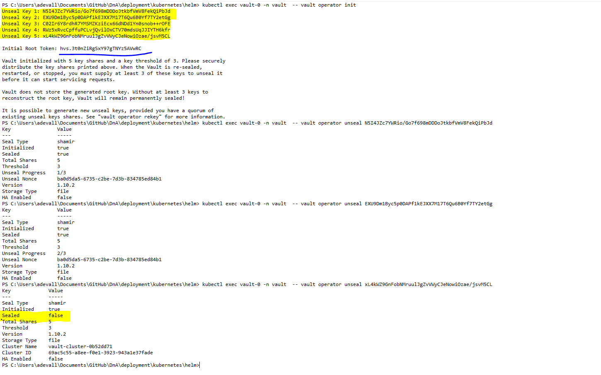
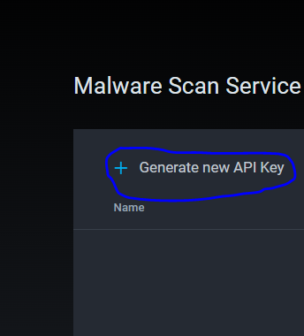

## **Install with docker-compose**

Docker Compose will help to start the application locally on your computer and provides support to develop and debug the docker containers in the local machine.

Software Prerequisites:

* Git 2.35.1+
* Docker 20.10.13+
* Docker Compose v2.3.3+
* JWT token
* Minio Username/Password

Hardware Prerequisites :

* Recommend 6GB free RAM
  
#### **Note**
  
  * *For windows user, enable WSL engine in Docker Desktop. Check [FAQ](./FAQ.md) to enable WSL*.
  * *Make sure your firewall is not restricting the npm and gradle packages of the docker files*.

#### **JWT Token**

JWT token is used to for the internal communication between microservices. You can generate this token by clicking on the link below. Copy the generated JWT token and update the value to the parameters `jwtKey`,`jwtSecretKey` in the [docker-compose-local-basic.yml](../deployment/docker-compose-local-basic.yml) and [values.yaml](../kubernetes/helm/values.yaml) 

* [JWT TOKEN GENERATOR](https://www.javainuse.com/jwtgenerator)

#### **Minio Username And Password**

Go to [minio sub-chart values.yaml](../deployment/kubernetes/helm/charts/minio/values.yaml) and specify the username and password of your wish and update the value to the parameters `minioAccessKey`,`s3AccessKey` , `minioSecretKey`,`s3SecretKey` in the parent [values.yaml](../kubernetes/helm/values.yaml).

Password should be a min length of  8 or more characters with a mix of letters, numbers & symbols.

#### **Git Cloning** 

Clone the Git Repo in your local computer. (this can be done by executing the below command on terminal/command prompt/some visual git client(GithubDesktop)).
```
git clone https://github.com/mercedes-benz/DnA.git
```
Once when cloning is finishied , you will have a copy of the entire repository locally.Go to the deployment folder by executing the the below command. (replace <`<Cloned Folder>`> with actual location path of your computer).
```
cd <<Clonned Folder Path>>/deployment/
```
#### **Docker Compose**
Execute the below docker-compose command to create the DnA application.
```
docker-compose -f docker-compose-local-basic.yml up -d
```
For Reference:


Open the website (http://localhost:8080) in your browser. If you have made any changes in the source files add `--build --force-recreate` args to docker-compose command. If you face any issue with docker-compose,refer [FAQ](./FAQ.md).

To stop the application.
```
docker-compose -f docker-compose-local-basic.yml down
```
-------------------------------------------------------------------------------------------------------
## **Install with Helm**

Helm helps you to deploy and manage Kubernetes applications in an easier way.

Prerequisites :

* Kubernetes Cluster 1.22+
* Helm v3.8.1+
* kubectl 1.22+
* Kafka [Refer here](https://github.com/apache/kafka)
* Docker Image Regitsry
* JWT token
* Minio Username/Password

#### **JWT Token**

JWT token is used to for the internal communication between microservices. You can generate this token by clicking on the link below. Copy the generated JWT token and mention the same under `jwtKey/jwtSecretKey` in the [values.yaml](../kubernetes/helm/values.yaml).

* [Refer here](https://www.javainuse.com/jwtgenerator)

#### **Minio Username And Password**

Go to [minio sub-chart values.yaml](../deployment/kubernetes/helm/charts/minio/values.yaml) and specify the username and password of you wish and mention the same under `minioAccessKey/s3AccessKey` , `minioSecretKey/s3SecretKey` in the parent [values.yaml](../kubernetes/helm/values.yaml) as well.

Password should be a combination of  8 or more characters with a mix of letters, numbers & symbols

*Eg: Minio@123

#### **Git Cloning** 

Clone the Git Repo in your local computer (this can be done by executing the below command on terminal/command prompt/some_visual_git_client(GithubDesktop)).

```
git clone https://github.com/mercedes-benz/DnA.git
```
Once when cloning is finishied, you will have a copy of the entire repository locally .Go to the deployment folder by executing the the below command.  (replace <`<Cloned Folder>`> with actual location path of your computer).
```
cd <<Clonned Folder Path>>/deployment/
```
#### **Build & push images**

Execute the below command to create images of dnA-frontend,dna-Backend, bitnami-postgress ,dashboard , malware , vault, clamav, naas-backend , zooKeeper , broker , storage-mfe , storage-be and minio .

Refer [docker-compose-local-basic.yml](../deployment/docker-compose-local-basic.yml)
```
cd <<Clonned Folder Path>>/deployment/
docker-compose -f docker-compose-local-basic.yml build
```
Execute the below commands for pushing the images to your reposirtory . Replace the contents that are enclosed in <<...>> to the respective values.
```
docker tag <<image_name_that_were_built_with_docker_compose>> <<your_repository_name/image_name_of_your_wish>>
docker push <<your_repository_name/image_name_of_your_wish>>
```
#### **Namespaces**

Execute the below commands to create namespaces.
```
kubectl create ns dna
kubectl create ns clamav
kubectl create ns naas
kubectl create ns dashboard
kubectl create ns vault
kubectl create ns storage
```
#### **values.yaml**

Update the image names of the respective services in the values.yaml.

  * Refer [values.yaml](../kubernetes/helm/values.yaml)

Eg: To update the image name of frontend-service , refer the below screenshot .Just like the below update the image names for every service in the [values.yaml](../kubernetes/helm/values.yaml).


For pulling the images from the registry, update the .dockerconfigjson value in the [values.yaml](../kubernetes/helm/values.yaml).

For more info on kubernetes secret for pulling the images.

  * Refer [harbor-pull-secret manifest file](../deployment/kubernetes/helm/charts/backend/templates/secrets/harbor-pull-secret.yaml)


#### **Helm**

We are offering mutiple services via this helm chart , Have a look into those by clicking the link [Readme.md](../README.md).

In order to use our helm charts you should have kafka service . you can install by referring the [Kafka Service](https://github.com/apache/kafka).

After installing the kafka, update the `naasBroker` parameter value in [Values.yaml](../deployment/kubernetes/helm/values.yaml) to the Fully qualified domain name of the kafka service.

Execute the below commands to deploy application on the kubernetes cluster using helm.
```
cd <<Clonned Folder Path>>\deployment\kubernetes\helm
helm install dna . -f ./charts/values.yaml
```
Execute the below command to list out the helm releases.
```
helm list
```
**Vault service**

We are providing vault service to store the API keys that were generated in the malware scan service.

After installating the application with helm , vault service will throw an error that `Readiness probe error in vault – Seal Type shamir Initialized true Sealed`.

To resolve this , intialize the vault service and unseal the root key .
```
kubectl exec vault-0 -n vault  -- vault operator init
```
After executing the above command , it will give us the root token and 5 keys . Save the root token and mention it in storagebe and backend sections of the [values.yaml](../deployment/kubernetes/helm/values.yaml).

We can unseal the vault service with any of the `3 keys out of 5`.
```
kubectl exec vault-0 -n vault  -- vault operator unseal <key_01>
kubectl exec vault-0 -n vault  -- vault operator unseal <key_02>
kubectl exec vault-0 -n vault  -- vault operator unseal <key_03>
```
For reference 



Execute the below commands to enable the kv engine for storing the secrets:
```
kubectl exec vault-0 -n vault  -- vault operator login <<Vault_root_token>>
kubectl exec vault-0 -n vault  -- vault secrets enable -version=2 -path=kv kv
```
**Attachment scan**

To scan the attachments free from malicious code  you can use the malware scan service . We are creating malware scan as a service by abstracting the [clamav service](https://github.com/Cisco-Talos/clamav).

To use this service, set the respective values to the below parameters in the [values.yaml](../deployment/kubernetes/helm/values.yaml).

Open the website http://localhost:7179 in your browser and go to `myservices->malwarescan -> Genrate the apikey` and copy the application key and application id.
```
avscanApiKey:   
avscanAppId: 
```
For reference:




**Upgrading**

Do Helm Upgrade, if you made changes on helm files.
```
helm upgrade dna . -f ./charts/values.yaml
```

**Accessing the application with localhost**

Port-forward the dna-frontend and storage-mfe service to any port_of_your_wish.

```
kubectl port-forward service/storage-mfe 7175:80
kubectl port-forward service/dna-frontend-service 7179:3000
```
After executing the above step , you can access the application by opening the (http://localhost:7179) in your browser.

**Production Environemnt**

We are already providing ingress manifest files for every microservice. So install any kubernetes ingress controller to install the application directly in the production environment.

By default, we are disabling the ingress in [values.yaml](../deployment/kubernetes/helm/values.yaml)* . If you are using in the production env then set the parameter `enabled: true` in the ingress section.

Eg : Please refer the below image and enable the ingress for every microservice.


**Note**

* *If you are not using 7175 and 7179 ports then change the below parameter values in [values.yaml](../deployment/kubernetes/helm/values.yaml)*. 
```
storageMFEAppURL:
PROJECTSMO_CONTAINER_APP_URL:
```

**Uninstalling**

To uninstall the helm app

```
helm uninstall dna
```
-------------------------------------------------------------------------------------------------------
DnA Platform can be configured quite a lot, have a look at possible config parameters:

* [Environment Variables](./APP-ENV-CONFIG.md)

Follow simple instructions on how to use simple and free Open ID Connect identity provider

* [OpenId Connect with OKTA](./OPENID-CONNECT.md)
##### FAQ

* [About GIT](https://git-scm.com/doc)
* [Docker installation.](https://docs.docker.com/get-docker/)
* [About docker-compose.](https://docs.docker.com/compose/)
* [Helm installation](https://helm.sh/docs/intro/install/)
* [About Helm](https://helm.sh/docs/)

**Troubleshooting**

* *If you face any issue with helm installation, refer [FAQ](./FAQ.md)*.