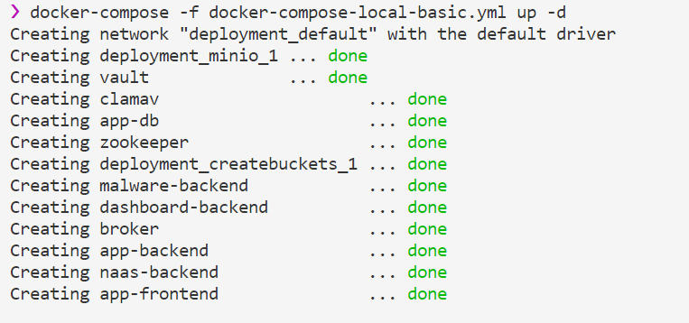
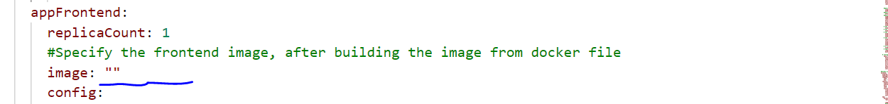
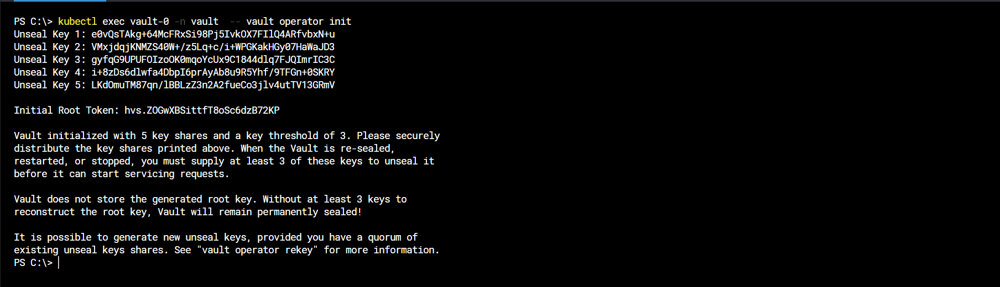
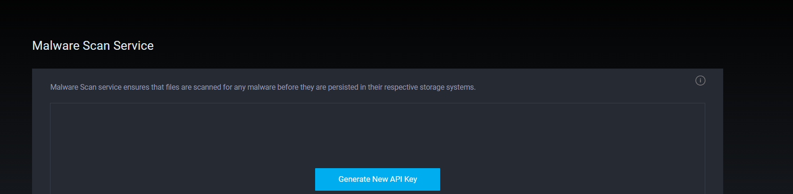
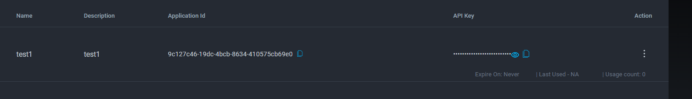
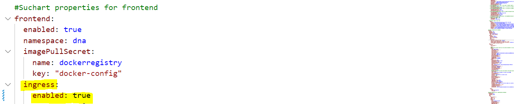

<h1>Installation Gudie</h1>

<h3>Prerequisties</h3>

<h4>JWT Token</h4>

JWT token is used to for the internal communication between microservices. You can generate this token by clicking on the link below. Copy the generated JWT token and update the value to the parameters `jwtKey`,`jwtSecretKey` in the [docker-compose-local-basic.yml](../deployment/docker-compose-local-basic.yml) and [values.yaml](../kubernetes/helm/values.yaml) 

* [JWT TOKEN GENERATOR](https://www.javainuse.com/jwtgenerator)

<h4>Git Cloning</h4>

Clone the Git Repo in your local computer. (this can be done by executing the below command on terminal/command prompt/some visual git client(GithubDesktop)).
```
git clone https://github.com/mercedes-benz/DnA.git
```
--------------------------------------------------------------------------------------------------------
<h2>Install with docker-compose</h2>

Docker Compose will help to start the application locally on your computer and provides support to develop and debug the docker containers in the local machine.

<h4>Software Prerequisites</h4>

* Git 2.35.1+
* Docker 20.10.13+
* Docker Compose v2.3.3+
* JWT token
* Minio Username/Password

<h4>Hardware Prerequisites</h4>

* Recommend 6GB free RAM
  
<h4>Note</h4>
  
  * *For windows user, enable WSL engine in Docker Desktop. Check [FAQ](./FAQ.md) to enable WSL*.
  * *Make sure your firewall is not restricting the npm and gradle packages of the docker files*.

<h4>Docker Compose</h4>

Once when cloning is finishied , you will have a copy of the entire repository locally.Go to the deployment folder by executing the the below command. `Replace contents enclosed in __<<...>>__ with actual location path of your computer `.
```
cd <<Clonned Folder Path>>/deployment/
```

Execute the below docker-compose command to create the DnA application.
```
docker-compose -f docker-compose-local-basic.yml up -d
```
For Reference:



Open the website (http://localhost:8080) in your browser. If you have made any changes in the source files add `--build --force-recreate` args to docker-compose command. If you face any issue with docker-compose,refer [FAQ](./FAQ.md).

To stop the application.
```
docker-compose -f docker-compose-local-basic.yml down
```
-------------------------------------------------------------------------------------------------------
<h1>Install with Helm</h1>

Helm helps you to deploy and manage Kubernetes applications in an easier way.

<h4>Prerequisites</h4>

* Kubernetes Cluster 1.22+
* Helm v3.8.1+
* kubectl 1.22+
* Kafka [Refer here](https://github.com/apache/kafka)
* Docker Image Regitsry
* JWT token
* Minio Username/Password

<h4>Minio Username And Password</h4>

Go to [minio sub-chart values.yaml](../deployment/kubernetes/helm/charts/minio/values.yaml) and specify the username and password of your wish and update the value to the parameters `minioAccessKey`,`s3AccessKey` , `minioSecretKey`,`s3SecretKey` in the parent [values.yaml](../kubernetes/helm/values.yaml).

Password should be a min length of  8 or more characters with a mix of letters, numbers & symbols.
<h4>Build & push images</h4>

Execute the below command to create images of dnA-frontend,dna-Backend, bitnami-postgress ,dashboard , malware , vault, clamav, naas-backend , zooKeeper , broker , storage-mfe , storage-be and minio .`Replace contents enclosed in __<<...>>__ with actual location path of your computer `.

Refer [docker-compose-local-basic.yml](../deployment/docker-compose-local-basic.yml) 
```
cd <<Clonned Folder Path>>/deployment/
docker-compose -f docker-compose-local-basic.yml build
```

Execute the below command for building the airflow-Backend , airflow and git-sync dockerfile.
```
docker-compose -f docker-compose-airflow.yml build
docker build ./dockerfiles/airflow -t airflow-service:latest -f ./dockerfiles/airlow/airflow.Dockerfile
docker build ./dockerfiles/airflow -t git-sync:latest -f ./dockerfiles/airflow/git-sync.Dockerfile
```

Execute the below command for building the images for the notebook service.
```
docker-compose -f ./docker-compose-notebook.yml build
```

Execute the below commands for pushing the images to your reposirtory.`Replace contents enclosed in **<<...>>** with image names that were built with docker compose`.
```
docker tag <<image_name_that_were_built_with_docker_compose>> <<your_repository_name/image_name_of_your_wish>>
docker push <<your_repository_name/image_name_of_your_wish>>
```
<h4>Namespaces</h4>

Execute the below commands to create namespaces.
```
kubectl create ns dna
kubectl create ns clamav
kubectl create ns naas
kubectl create ns dashboard
kubectl create ns vault
kubectl create ns storage
kubectl create ns airflow
```
<h4>values.yaml</h4>

Update the images of the respective services in the values.yaml. Refer [values.yaml](../deployment/kubernetes/helm/values.yaml)

Eg: To update the image name of frontend-service , refer the below screenshot .Just like the below update the image names for every service in the [values.yaml](../kubernetes/helm/values.yaml).



For pulling the images from the registry, update the .dockerconfigjson value in the [values.yaml](../kubernetes/helm/values.yaml).

For more info on kubernetes secret for pulling the images.

  * Refer [harbor-pull-secret manifest file](../deployment/kubernetes/helm/charts/backend/templates/secrets/harbor-pull-secret.yaml)

<h4>Airflow</h4>

We are also providing Apache Airflow as a service in the DnA platform to programmatically author , schedule and monitor workflows.

We are storing the DAGS of the airflow in the git repo . For this you need to create a new git repo and update the below values in the [Values.yaml](../deployment/kubernetes/helm/values.yaml).
```
gitToken:
gitUrl:
gitMountPath:
gitBranch:
gitUserName:
gitPassword:
repo: 
```
If you are accessing the git over ssh you can update those values in the below parametrs in the [Values.yaml](../deployment/kubernetes/helm/values.yaml)
```
knownHosts:
gitSshKey:
```

The below secret key is used to run the flask app. Refer the offical airflow docs for generating the secret key (https://airflow.apache.org/docs/apache-airflow/1.10.11/configurations-ref.html) 
```
webserver:
  secretkey:
```

<h4>Notebooks</h4>

We are also offering jupyter notebooks as a service in our DnA platform , which allows you to create and share documents that contain live code, mathematical equations, graphics, maps, plots, visualizations, and narrative text. It integrates with many programming languages like Python, PHP, R, C#, etc.

Update the configproxyauthtoken value in the [values.yaml](../deployment/kubernetes/helm/values.yaml) and this can be generated by using the below command.
```
openssl rand -hex 32
```
```
app:
  jupyter:
    config:
      configproxy_auth_token: ""
```

Update the value of the jupyter.api_token in the [hub_config.yaml](../deployment/kubernetes/helm/charts/notebooks/templates/hub-helm/hub-config.yaml) . This value can be generated by using the below command.
```
openssl rand -hex 32
```
**Note** - Update this apitoken value to the "notebookSecretToken" parameter in the backend section of the values.yaml

<h3>Helm</h3>

We are offering mutiple services via this helm chart , Have a look into those by clicking the link [Readme.md](../README.md).

In order to use our helm charts you should have kafka service . you can install by referring the [Kafka Service](https://github.com/apache/kafka).

After installing the kafka, update the `naasBroker` parameter value in [Values.yaml](../deployment/kubernetes/helm/values.yaml) to the Fully qualified domain name of the kafka service.

Execute the below commands to deploy application on the kubernetes cluster using helm.`Replace contents enclosed in **<<...>>** with actual location path of your computer`.
```
cd <<Clonned Folder Path>>\deployment\kubernetes
helm install dna helm/
```
Execute the below command to list out the helm releases.
```
helm list
```
<h3>Follow the below steps for seamless experience in DnA application</h3>

<h4>Vault service</h4>

We are providing vault service to store the API keys that were generated in the malware scan service.

After installating the application with helm , vault service will throw an error that `Readiness probe error in vault – Seal Type shamir Initialized true Sealed`.

To resolve this , intialize the vault service and unseal the root key .
```
kubectl exec vault-0 -n vault  -- vault operator init
```
After executing the above command , it will give us the root token and 5 keys . Save the root token and mention it in storagebe and backend sections of the [values.yaml](../deployment/kubernetes/helm/values.yaml).

We can unseal the vault service with any of the `3 keys out of 5`.
```
kubectl exec vault-0 -n vault  -- vault operator unseal <key_01>
kubectl exec vault-0 -n vault  -- vault operator unseal <key_02>
kubectl exec vault-0 -n vault  -- vault operator unseal <key_03>
```
For reference 



Execute the below commands to enable the kv engine for storing the secrets and `replace contents enclosed in __<<...>>__ with your generated root token `.
```
kubectl exec vault-0 -n vault  -- vault operator login <<Vault_root_token>>
kubectl exec vault-0 -n vault  -- vault secrets enable -version=2 -path=kv kv
```
<h4>Attachment scan</h4>

To scan the attachments free from malicious code  you can use the malware scan service . We are creating malware scan as a service by abstracting the [clamav service](https://github.com/Cisco-Talos/clamav).

To use this service, set the respective values to the below parameters in the [values.yaml](../deployment/kubernetes/helm/values.yaml).

Open the website http://localhost:7179 in your browser and go to `myservices->malwarescan -> Genrate the apikey` and copy the application key and application id.
```
avscanApiKey:   
avscanAppId: 
```
For reference:




<h2>Accessing the application over localhost</h2>

In order to access the DnA application over localhost you need to port-forward the below service.
```
kubectl port-forward service/storage-mfe 7175:80 -n storage
kubectl port-forward service/naas-backend-service 9004:7272 -n naas
kubectl port-forward service/dashboard-backend-service 9005:7173 -n dashboard
kubectl port-forward service/proxy-public 9001:8000 -n notebooks
kubectl port-forward service/clamav-rest-service 9002:8181 -n clamav
kubectl port-forward service/airflow 9010:8080 -n airflow
kubectl port-forward service/airflow-backend-service 9003:7171 -n airflow
kubectl port-forward service/dna-frontend-service 8080:3000 -n dna
```
After executing the above step , you can access the application by opening the (http://localhost:8080) in your browser.

**Note** -- If you change any port numbers of the services then you also need to change the respective values in the [values.yaml](../deployment/kubernetes/helm/values.yaml)

<h2>Production Environemnt</h2>

We are already providing ingress manifest files for every microservice. So install any kubernetes ingress controller to install the application directly in the production environment.

By default, we are disabling the ingress in [values.yaml](../deployment/kubernetes/helm/values.yaml)* . If you are using in the production env then set the parameter `enabled: true` in the ingress section.

Eg : Please refer the below image and enable the ingress for every microservice.



<h2>Upgrading</h2>

Do Helm Upgrade, if you made changes on helm files.

`Replace contents enclosed in __<<...>>__ with actual location path of your computer `.
```
cd <<Clonned Folder Path>>\deployment\kubernetes 
helm upgrade dna helm/
```


<h2>Uninstalling</h2>

To uninstall the helm app

```
helm uninstall dna
```

<h2>Customizing the DnA platform</h2>

<h4>Frontend</h4>

You can customize our DNA platform application with the paramerts in the frontend section of the [values.yaml](../deployment/kubernetes/helm/values.yaml)

By default all services like (Jupyter workspace , Malware Scan , Data Pipeline (airflow) , Storage Service , Reports (Dashboard) , Notifications) were enabled in the dna-frontend service [values.yaml](../deployment/kubernetes/helm/values.yaml). If you don`t want to install any of the above respective service you can turn it off by seeting the below parameter value to "false".
```
ENABLE_JUPYTER_WORKSPACE: true
ENABLE_MALWARE_SCAN_SERVICE: true
ENABLE_DATA_PIPELINE_SERVICE: true
ENABLE_STORAGE_SERVICE: true
ENABLE_REPORTS: true
ENABLE_NOTIFICATION: true
```
<h4>DnA Platform can be configured quite a lot, have a look at possible config parameters</h4>

* [Environment Variables](./APP-ENV-CONFIG.md)

<h4>Follow simple instructions on how to use simple and free Open ID Connect identity provider</h4>

* [OpenId Connect with OKTA](./OPENID-CONNECT.md)

<h2>FAQ</h2>

* [About GIT](https://git-scm.com/doc)
* [Docker installation.](https://docs.docker.com/get-docker/)
* [About docker-compose.](https://docs.docker.com/compose/)
* [Helm installation](https://helm.sh/docs/intro/install/)
* [About Helm](https://helm.sh/docs/)

<h2>Troubleshooting</h2>

* *If you face any issue with helm installation, refer [FAQ](./FAQ.md)*.